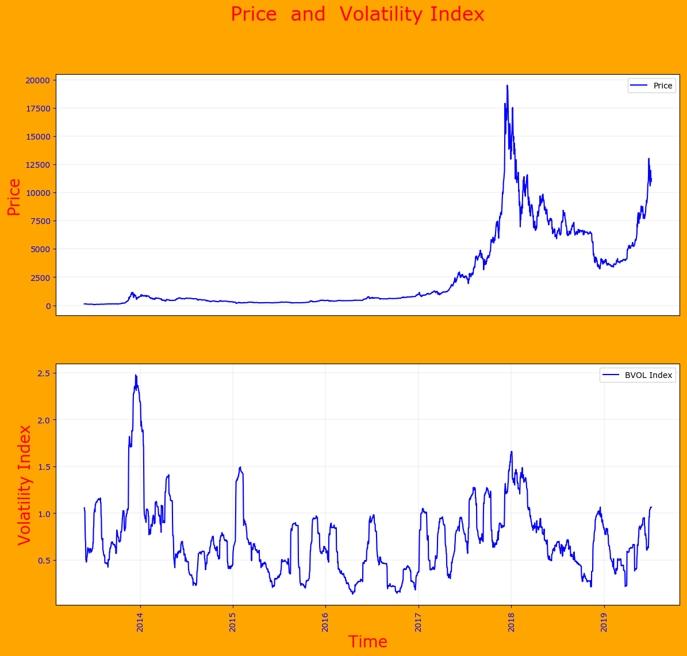
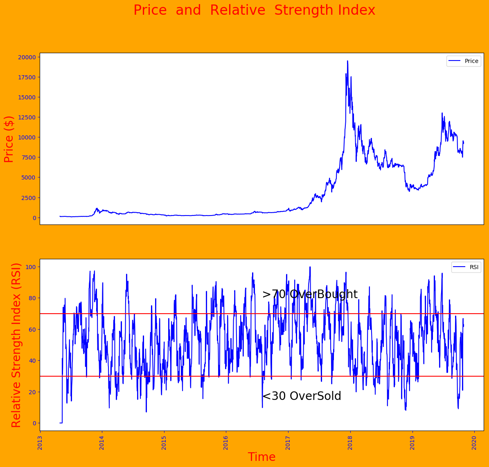
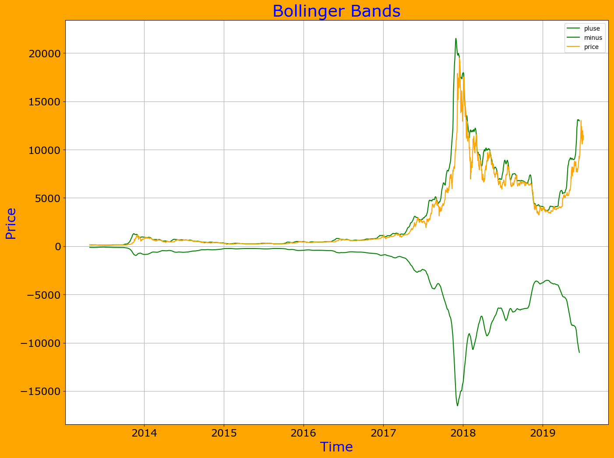
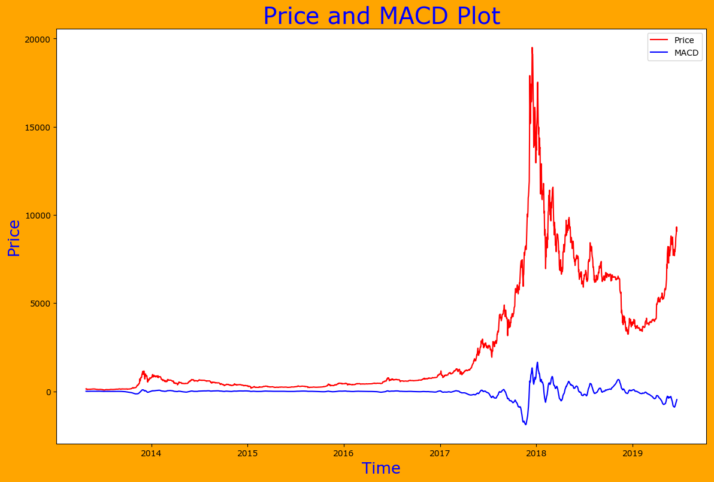
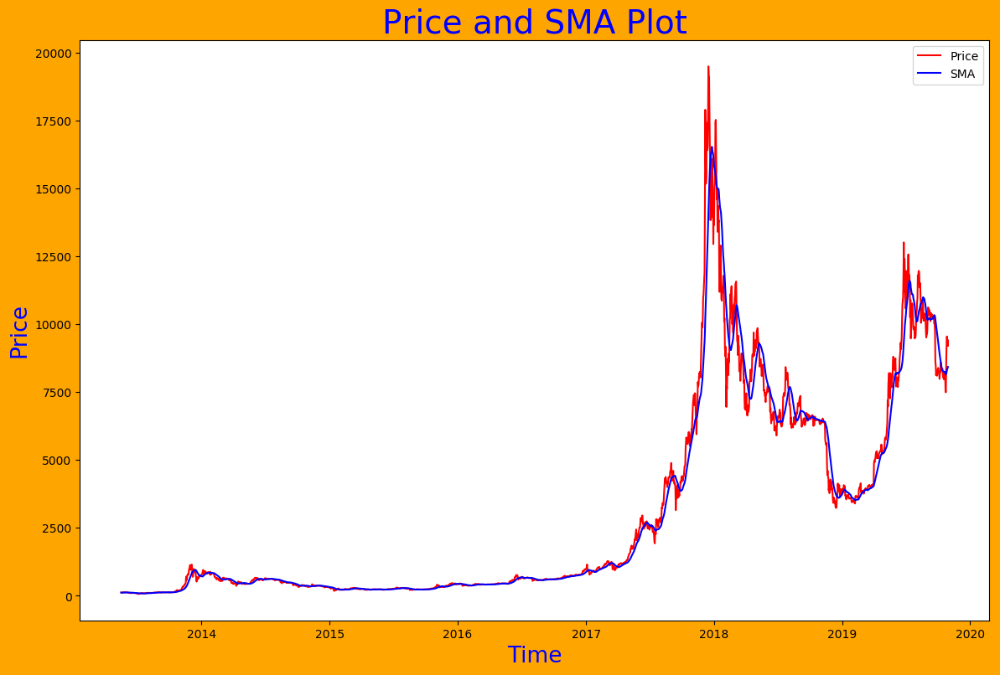
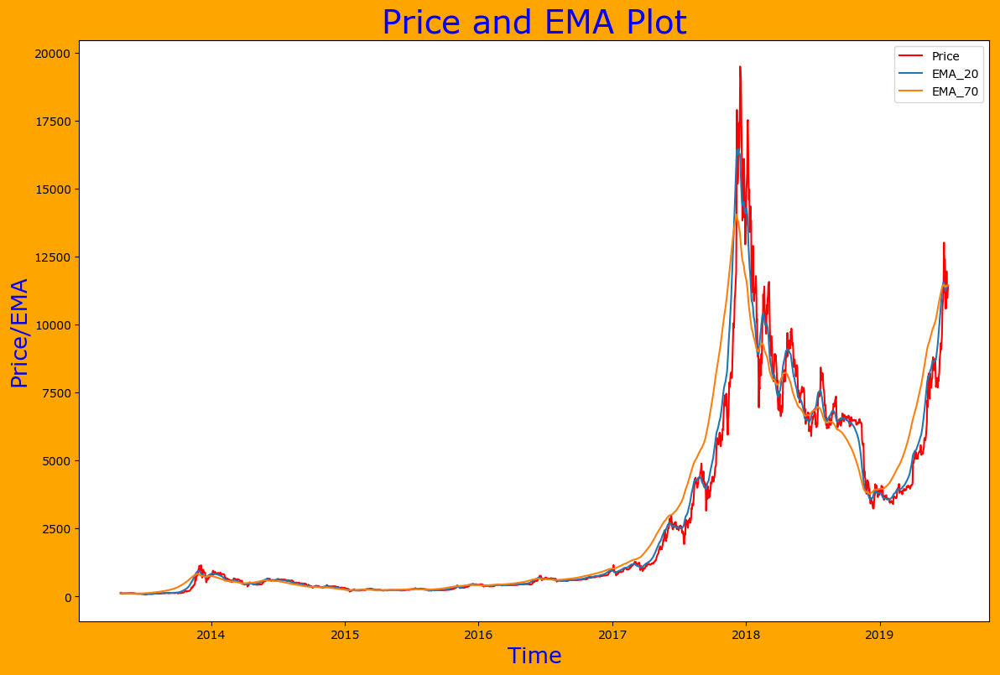

## Installation 

### pip 

```
pip install PriceIndics
```

### From Source (Github)
 
 git clone https://github.com/dc-aichara/Price-Indices.git
 
 cd Price-Indices 
 
 python3 setup.py install
 
## Usages 
 
```python
from PriceIndices import MarketHistory, Indices

```
## Examples 

- #### Get market history and closing price

```python
>>> history = MarketHistory()

# Get Market History 

>>> df_history = history.get_history('bitcoin', '20130428', '20190624')  
>>> df_history.head()
        Date     Open*      High       Low   Close**       Volume    Market Cap
0 2019-06-23  10696.69  11246.14  10556.10  10855.37  20998326502  192970090355
1 2019-06-22  10175.92  11157.35  10107.04  10701.69  29995204861  190214124824
2 2019-06-21   9525.07  10144.56   9525.07  10144.56  20624008643  180293241528
3 2019-06-20   9273.06   9594.42   9232.48   9527.16  17846823784  169304784791
4 2019-06-19   9078.73   9299.62   9070.40   9273.52  15546809946  164780855869

# Get closing price

>>> price_data  =  history.get_price('bitcoin', '20130428', '20190624')  

>>> price_data .head()
        date     price
0 2019-06-23  10855.37
1 2019-06-22  10701.69
2 2019-06-21  10144.56
3 2019-06-20   9527.16
4 2019-06-19   9273.52

```

- #### Calculate Volatility Index

```python

>>> df_bvol = Indices.get_bvol_index(price_data )  
>>> df_bvol.head()
        date    price  BVOL_Index
0 2019-10-29  9427.69    0.711107
1 2019-10-28  9256.15    0.707269
2 2019-10-27  9551.71    0.709765
3 2019-10-26  9244.97    0.698544
4 2019-10-25  8660.70    0.692656

```

- #### Plot Volatility Index

```python
>>> Indices.get_bvol_graph(df_bvol)   

"""
This will return a plot of BVOL index against time also save volatility index plot in your working directory as 'bvol_index.png'
"""
```



- #### Calculate Relative Strength Index (RSI)

```python

>>> df_rsi = Indices.get_rsi(price_data)   

>>> print(df_rsi.head())
        date    price       RSI_1  RS_Smooth      RSI_2
0 2019-10-30  9205.73      64.641855   1.624958  61.904151
1 2019-10-29  9427.69      65.707097   1.709072  63.086984
2 2019-10-28  9256.15      61.333433   1.597755  61.505224
3 2019-10-27  9551.71      66.873327   2.012345  66.803267
4 2019-10-26  9244.97      63.535368   1.791208  64.173219


```

- #### Plot RSI

```python
>>> Indices.get_rsi_graph(df_rsi)  

"""
This will return a plot of RSI against time and also save RSI plot in your working directory as 'rsi.png'
"""
```



- #### Get Bollinger Bands and its plot

```python
>>> df_bb = Indices.get_bollinger_bands(price_data , 20, plot=True) 
>>> df_bb.head()
        date    price     BB_upper   BB_lower
0 2019-10-30  9205.73  9635.043581 -8428.5855
1 2019-10-29  9427.69  9550.707153 -8397.6225
2 2019-10-28  9256.15  9408.263164 -8356.0250
3 2019-10-27  9551.71  9268.466516 -8304.6565
4 2019-10-26  9244.97  9003.752779 -8239.3520


"""
This will also save Bollingers bands plot in your working directory as 'bollinger_bands.png'
"""

```




- #### Get Moving Average Convergence Divergence (MACD) and its plot

```python

>>> df_macd = Indices.get_moving_average_convergence_divergence(price_data, plot=True)
"""This will return a pandas DataFrame and save EMA plot as 'macd.png' in working directory. 
""""
>>> df_macd.head()
        date    price       MACD
0 2019-10-30  9205.73   0.000000
1 2019-10-29  9427.69  17.706211
2 2019-10-28  9256.15  17.692715
3 2019-10-27  9551.71  41.057952
4 2019-10-26  9244.97  34.426864


```



- #### Get Simple Moving Average (SMA) and its plot

```python
>>> df_sma = Indices.get_simple_moving_average(price_data, 20, plot=True) 
"""This will return a pandas DataFrame and save EMA plot as 'sma.png' in working directory. 
""""
>>> df_sma.head()
        date    price          SMA
0 2019-10-30  9205.73  8467.488000
1 2019-10-29  9427.69  8400.797333
2 2019-10-28  9256.15  8330.597333
3 2019-10-27  9551.71  8268.254667
4 2019-10-26  9244.97  8187.244667


```



- ### Get Exponential Moving Average (EMA) and its plot

```python
>>> df_ema = Indices.get_exponential_moving_average(price_data, [20,70], plot=True)
"""This will return a pandas DataFrame and save EMA plot as 'ema.png' in working directory. 
""""

>>> df_ema.head()
        date    price       EMA_20       EMA_70
0 2019-10-30  9205.73  9205.730000  9205.730000
1 2019-10-29  9427.69  9226.869048  9211.982394
2 2019-10-28  9256.15  9229.657710  9213.226552
3 2019-10-27  9551.71  9260.329356  9222.761297
4 2019-10-26  9244.97  9258.866561  9223.386895
>>> 


```



### License
 
[MIT](https://choosealicense.com/licenses/mit/) © [Dayal Chand Aichara](https://github.com/dc-aichara)


### Check out [webpage](https://dc-aichara.github.io/PriceIndices/) of PriceIndices package. 

### Disclaimer: 

```
All content provided here, is for educational purpose and your general information only, procured  from third party sources.
I make no warranties of any kind in relation to this content, including but  not limited to accuracy
and updatedness. No part of the content that I provide  constitutes  financial  advice, legal advice 
or any other form of advice meant for your specific reliance for any purpose. Any use or reliance on
my content is solely at your own risk  and  discretion. You should conduct your own research, review, 
analyse and  verify my content  before relying  on them. Trading is a highly risky activity that can 
lead to  major  losses, please  therefore  consult your financial advisor before making any decision.
No content on this Site is meant to be a solicitation or offer.
```
